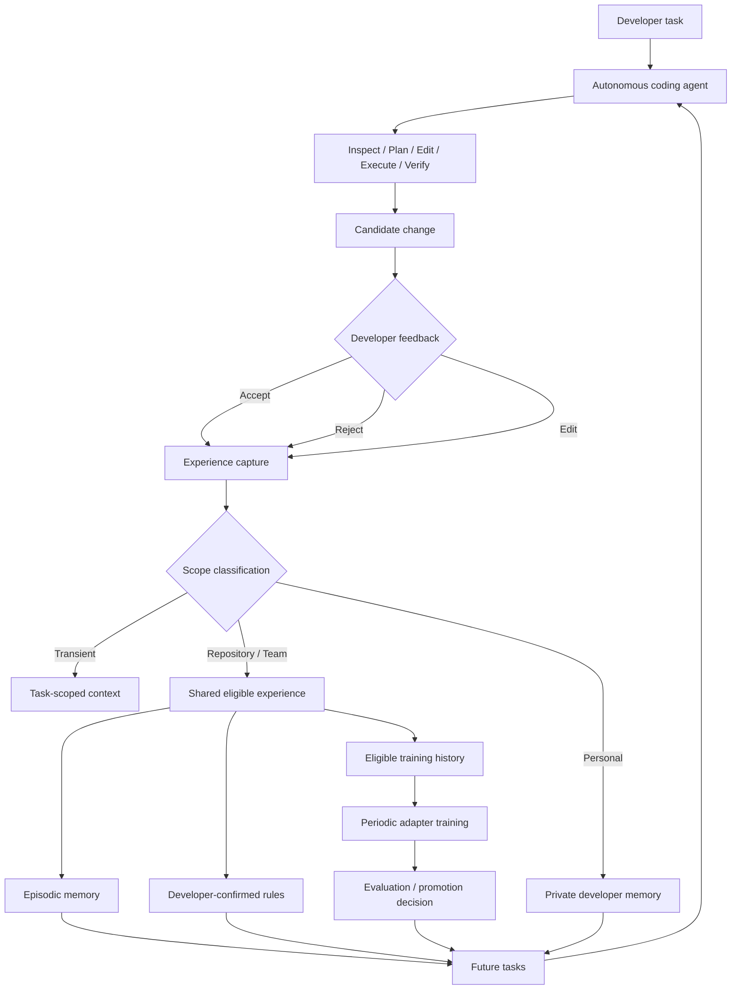

# Adaptive Coding Agent

An adaptive, continuously adapting coding-agent project with a concrete goal:
become measurably better at working with a developer, team and repository through
normal development feedback. The autonomous product loop is under development;
the repository currently provides evaluation, deterministic context-policy and
research-integrity infrastructure for testing that goal.

## Why this exists

Coding assistance should retain useful experience without treating every correction
as a universal instruction. A temporary workaround, a developer's personal preference
and a team convention have different scopes. This project aims to capture those
distinctions and test whether the resulting adaptation helps on future tasks.

## Core idea

The planned agent will inspect a repository, plan and edit a change, execute tools,
and verify its work. Developer **Accept / Reject / Edit** feedback will create an
experience record with source lineage and scope. Rejected attempts are not automatic
training targets; weight supervision uses eligible, approved resolutions.

**TRANSIENT** feedback stays within its task scope. **PERSONAL** feedback belongs to
an explicitly authorized private developer scope. **REPOSITORY/TEAM** experience can
support shared memory, confirmed rules and eligible training history.
Personal preferences must never silently enter shared repository adapters.

## Architecture

Conceptual target architecture; the autonomous loop and adaptation services below
are planned, not an implemented end-to-end product.



## Three adaptation layers

- **Memory:** useful prior episodes and context, with provenance and scoped reuse.
- **Rules:** explicit, developer-confirmed recurring repository constraints and
  conventions; repetition alone does not confirm a rule.
- **Weights:** periodic PEFT/QLoRA specialization from eligible accumulated
  repository/team history, followed by evaluation before adapter promotion.

These layers convey different information. Memory retrieval, rule confirmation
and weight updates each need their own eligibility and verification controls.

## Current status

**Implemented / existing**

- Experiment harness, scorer interfaces and target/regression/convention evaluation.
- Deterministic P/K/H context construction and no-generation admission interfaces.
- Provenance, researcher/model isolation and outcome-independent defect governance.
- Synthetic context-policy conformance checks and an independent verification path.
- Historical development-experiment infrastructure and existing Python reference
  projects. Historical evidence remains separate from future controlled studies.
- A Development Subject design specifying an independently governed adaptation and
  evaluation track; it is not a selected model, trained adapter or feasibility certificate.

**In progress / next**

- Autonomous coding runtime and filesystem/search/edit/command/test tool loop.
- Verification and self-correction, feedback capture and scope classification.
- Episodic memory, confirmed repository rules and the end-to-end adaptive loop.
- Periodic weight adaptation, adapter promotion and local deployment.

The existing experiment runner is not the planned autonomous agent. No measured
improvement from an end-to-end adaptive product is claimed.

## Research question

Can accumulated repository/developer experience improve performance on future,
unseen tasks from the same repository? A separate evaluation track compares memory,
confirmed rules and weight adaptation, allowing negative findings and requiring
pre-outcome controls. Research design does not establish that adaptation works.

## Repository structure

| Path | Role |
| --- | --- |
| `harness/` | Existing experiment, evaluation, provenance and isolation infrastructure. |
| `harness/context_policy/` | Deterministic context construction, admission and provenance interfaces. |
| `harness/tests/` | Harness tests, including guarded synthetic context-policy checks. |
| `benchmark_design/` | Researcher-only design and governance; excluded from experimental model inputs. |
| `benchmark_design/development_subject/` | Development Subject design, stage gates and recipe documentation. |
| `taskflow_base/` | Reference product tree used by the legacy harness. |
| `orderflow/`, `safesync/` | Existing Python reference projects with their own documentation. |
| `experiments/`, `memory/`, `rules/`, `rubrics/` | Existing experiment/condition/evaluator assets; not a product runtime quickstart. |
| `results/`, `workspaces/` | Local result and disposable workspace locations; generated contents are ignored. |

## Getting started

An autonomous-agent quickstart is under development. The following existing checks
exercise synthetic context-policy behavior without a model or inference service.
Use **CPython 3.11.9** (Unicode 14.0.0) with **pytest** installed and selected as
`python`, then run from the repository root:

```powershell
python -B -m pytest -p harness.tests.policy_scope_guard `
    harness/tests/test_context_policy.py `
    harness/tests/test_context_policy_repairs.py `
    harness/tests/test_policy_independent.py -q
```

The opt-in guard blocks real experiment/result assets and real network connections.
These checks establish synthetic protocol behavior, not production authentication,
model capacity or adaptation quality. See
[context-policy documentation](harness/context_policy/README.md) for the runtime
requirements and external certification interfaces. The ignored local runtime is
not bundled with a fresh clone.

## Roadmap

1. Autonomous coding runtime.
2. Repository inspection and tool execution.
3. Verification and self-correction.
4. Developer feedback capture.
5. Scope classification.
6. Episodic memory.
7. Confirmed repository rules.
8. End-to-end adaptive loop.
9. Development Subject integration with free-Colab QLoRA.
10. Adapter evaluation and promotion.
11. Local deployment.
12. Controlled studies.

## Research integrity

Future protected tasks and private evaluator material stay outside agent context
and training. Candidate selection cannot use adaptation outcomes, and candidate
information collection requires its own approved, frozen audit envelope. Every
weight-adaptation stage starts from the ORIGINAL base with a fresh adapter.
Native Hugging Face/PEFT is the research evaluation authority; local deployment
transformations and fidelity are assessed separately. Studies, model acquisition
and runtime certification require separate authorization.
